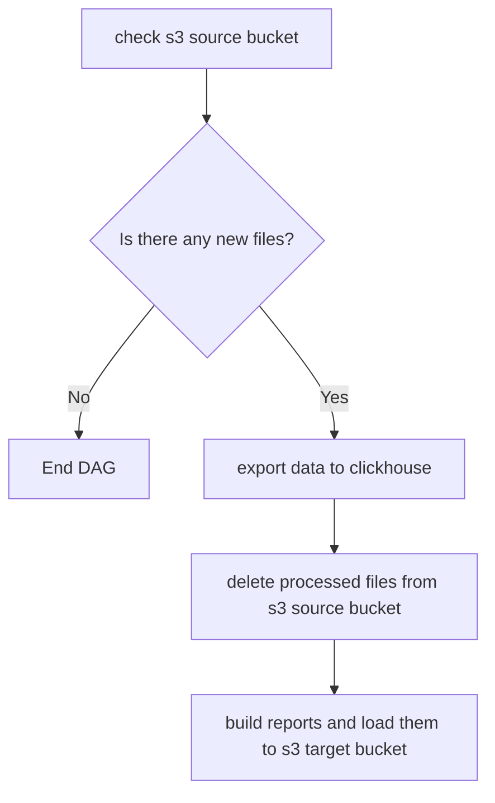

# airflow_s3_to_clickhouse_dag

Airflow - сборка от bitnami
https://hub.docker.com/r/bitnami/airflow/

Для соединения с Clickhouse - airflow-clickhouse-plugin
https://github.com/whisklabs/airflow-clickhouse-plugin/blob/master/README.md

Настройки соединений с S3 и Clcikhouse сохранены в Airflow Connections (переменные S3_CONN_ID, CLICKHOUSE_CONN_ID)
Названия S3 buckets, список e-mail для рассылки сохранены в Airflow Variables(переменные S3_SOURCE_BUCKET, S3_TARGET_BUCKET)

Задача: проверить S3 bucket на наличие файлов с сырыми данными (отчеты в формате csv в zip-архиве, поступающие из внешней системы или загруженные вручную), импортировать данные в существующую таблицу Clickhouse, сформировать и выгрузить в другой s3 bucket статистические отчеты.

Общая схема пайплайна:

